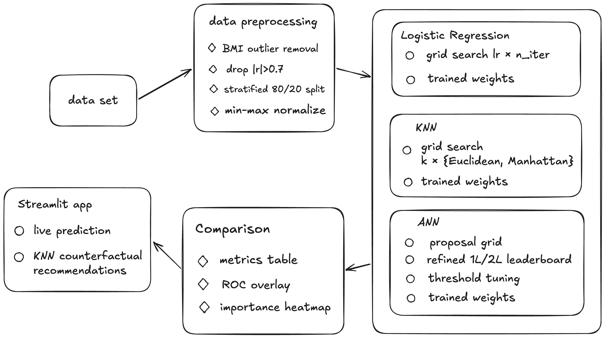

# Cross-Model Feature Importance for Type 2 Diabetes Prediction



**INFO 5368 · Cornell Tech**

We compare three NumPy-only classifiers — Logistic Regression, KNN, and a 1/2-layer ANN — on the **CDC BRFSS 2015 Diabetes Health Indicators** dataset, and look at which features each model relies on via permutation importance.

**Dataset:** [Kaggle — Diabetes Health Indicators](https://www.kaggle.com/datasets/alexteboul/diabetes-health-indicators-dataset). We use the balanced 50/50 binary split (`diabetes_binary_5050split_health_indicators_BRFSS2015.csv`, 70,692 records, 21 features). 

We have downloaded the CSV manually and drop it into `data/`.


## 1. How to run

```bash
pip install -r requirements.txt
jupyter notebook complete_pipeline.ipynb   # then "Run All"
```

That's it. [complete_pipeline.ipynb](complete_pipeline.ipynb) is fully self-contained — preprocessing, training all three models, evaluation, and cross-model comparison. By default it reuses cached artifacts in `models/`, so re-runs are fast; flip the `RETRAIN_*` flags at the top of each section to force a fresh run.

## 2. Streamlit app

The interactive demo (live prediction + KNN-based "what to change" recommendations) lives in `app.py`. See **[README_frontend_backend.md](README_frontend_backend.md)** for setup and request-flow details.

[Streamlit web app](https://mlcross-model-feature-importance-for-diabetes-prediction-aqx3o.streamlit.app/)

### Current setup

This project currently uses a single Streamlit app (`app.py`) for both UI and prediction logic.

- Frontend: Streamlit inputs and layout
- Backend: model loading, normalization, and inference
- Artifacts: all trained files are read from `models/`

There is no separate API server right now.

### Request flow

1. User enters health indicators in Streamlit.
2. App builds a feature vector using `feature_names.npy`.
3. Input is normalized with `feat_min.npy` and `feat_max.npy`.
4. Selected model (ANN / Logistic Regression / KNN) runs `predict_proba`.
5. App shows probability, risk class, and feature-importance chart.

### Files involved

- `app.py`: UI + inference flow
- `preprocess.py`: preprocessing and saved normalization stats
- `ann_model.py`, `logistic_regression.py`, `knn_model.py`: model training and prediction interfaces

### Input / output

Input: 21 health features (binary, ordinal, continuous).  
Output:
- `selected_model`
- `diabetes_probability` (0 to 1)
- `predicted_class` (`High Risk` if >= 0.5, else `Low Risk`)

### Error handling

- If preprocessing artifacts are missing, app stops with setup instructions.
- If some model files are missing, only available models are shown.
- If no model is available, app stops with an error message.

### Run locally

```bash
python preprocess.py
python ann_model.py          # or logistic_regression.py / knn_model.py
streamlit run app.py
```

### Optional: split into real frontend + backend

If needed later, move prediction logic into an API service (e.g., `POST /predict`) and let Streamlit call it through HTTP.
